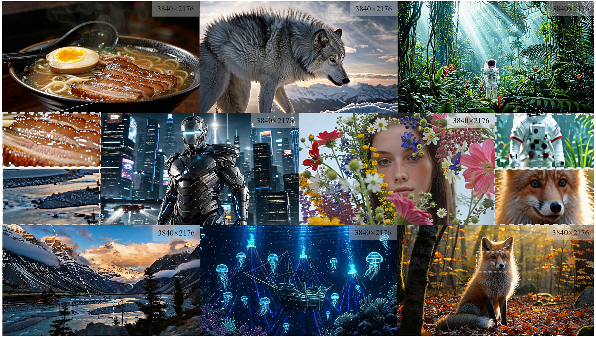
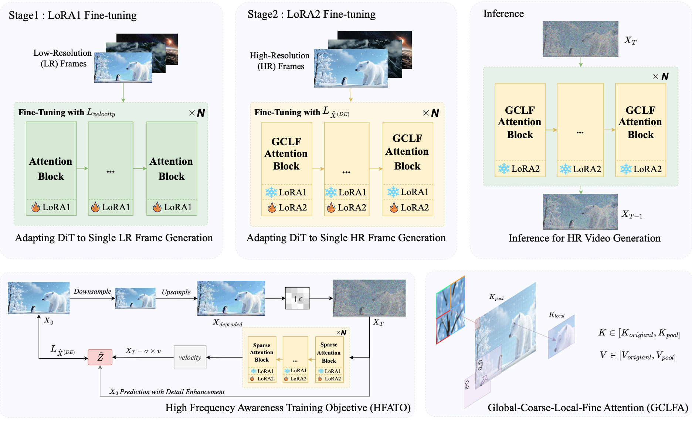

# ViBe
# **ViBe: Ultra-High-Resolution Video Synthesis Born from Pure Images** 🎥✨

[](https://arxiv.org/pdf/2603.23326)

<!-- Teaser 放在比较靠前的位置 -->


<p align="center"><em>Teaser: ViBe generates ultra-high-resolution videos with rich details and coherent global structure. ✨</em></p>

## **Introduction** 🎬

**ViBe** presents an **image-only training framework** for **ultra-high-resolution video generation**, aiming to unlock **4K video synthesis** from pre-trained video Diffusion Transformers without expensive high-resolution video training. Instead of relying on large-scale high-resolution video data, ViBe explores how a low-resolution video generator can be effectively adapted using only image supervision.

A central challenge in this setting is the **modality gap between images and videos**. Directly fine-tuning a video model on high-resolution images often leads to artifacts and residual noise during video inference. To address this, ViBe introduces **Relay LoRA**, a two-stage adaptation strategy that separates **modality alignment** from **spatial extrapolation**, enabling high-resolution generation while reducing image-induced degradation.

To further improve generation quality, ViBe proposes **Global-Coarse-Local-Fine (GCLF) Attention**, which combines local fine-grained modeling with compact global context aggregation. This design improves detail fidelity while maintaining semantic consistency across the entire frame.

ViBe also introduces a **High-Frequency-Awareness Training Objective (HFATO)** to enhance the recovery of fine textures and sharp structures from degraded latent inputs. This leads to clearer and more detailed high-resolution video synthesis.

Extensive experiments on modern video DiTs, such as **Wan2.2**, show that ViBe can generate **4K videos** with strong semantic coherence and rich visual details, achieving **state-of-the-art performance on VBench**.

## **Methodology** 🧠

- **Relay LoRA for Decoupled Adaptation**: 🔄 We introduce **Relay LoRA**, a two-stage adaptation strategy that first bridges the **image--video modality gap** at low resolution and then learns **spatial extrapolation** at high resolution, enabling high-resolution video synthesis while avoiding image-induced artifacts.

- **Global-Coarse-Local-Fine Attention**: 🔍 We design **GCLF Attention**, which combines localized fine-grained modeling with compact global context aggregation, improving detail fidelity while preserving semantic consistency across ultra-high-resolution frames.

- **High-Frequency-Awareness Training Objective**: ✨ We propose **HFATO**, a training objective that explicitly enhances the model’s ability to recover **high-frequency textures and structural details** from degraded latent inputs, leading to sharper and more realistic video generation results.


<!-- 方法架构图放在 Methodology 下面 -->


<p align="center"><em>Figure: Overview of the ViBe framework. 🧩</em></p>

## **Results** 🏆

**ViBe** outperforms previous state-of-the-art methods on **VBench**, with significant improvements in aesthetic appeal, imaging quality, and overall consistency.  🌈


## **Citation** 📚

If you use **ViBe** in your research, please cite our paper:

```bibtex
@misc{wu2026vibeultrahighresolutionvideosynthesis,
      title={ViBe: Ultra-High-Resolution Video Synthesis Born from Pure Images}, 
      author={Yunfeng Wu and Hongying Cheng and Zihao He and Songhua Liu},
      year={2026},
      eprint={2603.23326},
      archivePrefix={arXiv},
      primaryClass={cs.CV},
      url={https://arxiv.org/abs/2603.23326}, 
}